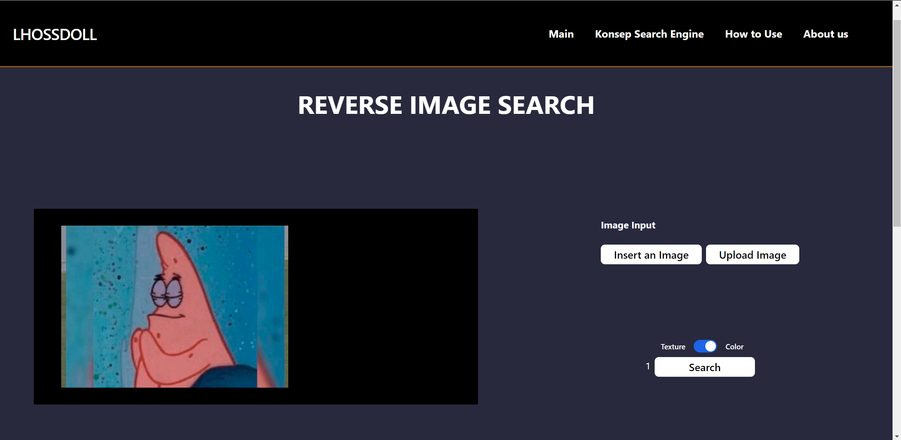
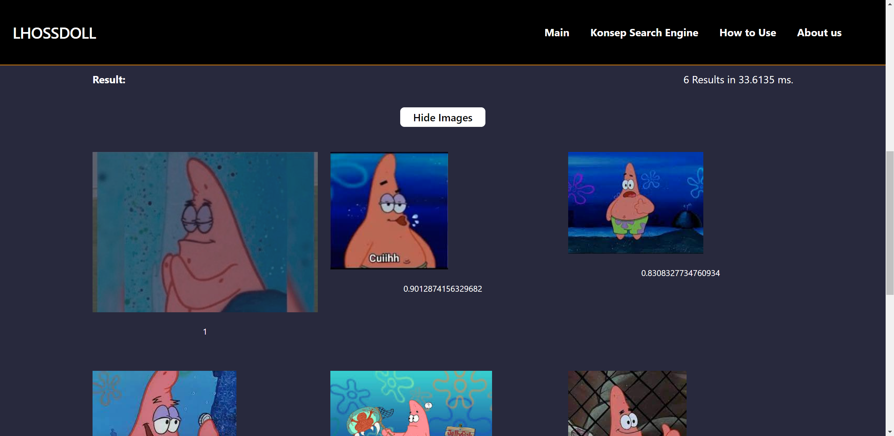

# Aplikasi Aljabar Vektor dalam Sistem Temu Balik Gambar
> Tugas Besar 2 IF2123 Aljabar Linier dan Geometri
Aplikasi Aljabar Vektor dalam Sistem Temu Balik Gambar
Semester I Tahun 2023/2024

## Table of Contents
* [General Info](#general-information)
* [How to Use](#how-to-use)
* [Features](#features)
* [Screenshots](#screenshots)
* [Setup](#setup)
* [Contact](#contact)
<!-- * [License](#license) -->

## General Information
- Di dalam Tugas Besar 2 ini, kami mengimplementasikan sistem temu balik gambar dengan memanfaatkan Aljabar Vektor dalam bentuk sebuah website, dimana hal ini merupakan pendekatan yang penting dalam dunia pemrosesan data dan pencarian informasi. Dalam konteks ini, aljabar vektor digunakan untuk menggambarkan dan menganalisis data menggunakan pendekatan klasifikasi berbasis konten (Content-Based Image Retrieval atau CBIR), di mana sistem temu balik gambar bekerja dengan mengidentifikasi gambar berdasarkan konten visualnya, seperti warna dan tekstur.

## How to use
- Pada website ini, terdapat 4 halaman, yaitu halaman Search Engine Concept, About Us, Reverse Image Search, dan How to Use. Saat program dijalankan, pengguna pertama kali akan masuk ke halaman utama yaitu halaman Reverse Image Search.
- Kita dapat mencari kemiripan gambar query dengan gambar dari data set dengan cara mengupload data set dalam web dengan select multiple image. Pertama tekan tombol choose files dan pilih gambar dengan multiple image. Setelah dipilih, klik submit.
- Setelah itu kita diminta untuk upload gambar yang akan dicari kemiripannya dengan cara insert gambar lalu tekan uplaod gambar.
- Langkah terakhir, kita dapat memilih untuk mencari kemiripan gambar dengan metode perbandingan warna atau tekstur. Lalu tekan tombol search.
- Hasil dapat dilihat dengan menekan tombol show images

## Features
- Mencari gambar yang mirip berdasarkan warna
- Mencari gambar yang mirip berdasarkan tekstur
- Image Scraping dari sebuah website

## Screenshots

## Setup
Install for Front End:
- npm install react-router-dom
- npm install react
- npm install vite
- npm install prop-types
- npm install lodash
- npm install @testing-library/react
- npm install react-dom/client

Install for Back End:
- go get "github.com/gorilla/mux"
- go get "gonum.org/v1/gonum/mat"
- go get "gonum.org/v1/gonum/floats"
- go get "gonum.org/v1/gonum/mat"

Run Front end:
{Masuk ke folder website}
- cd website
- npm run dev

Run Back End:
{Masuk ke foler bcakend}
- cd website
- cd src
- cd backend
- go run .

## Contact
-Eduardus Alvito K. 	(13522004@mahasiswa.itb.ac.id)

-Edbert Eddyson G.	    (13522039@mahasiswa.itb.ac.id)	

-Keanu Amadius G. W.	(13522082@mahasiswa.itb.ac.id)

<!-- Optional -->
<!-- ## License -->
<!-- This project is open source and available under the [... License](). -->

<!-- You don't have to include all sections - just the one's relevant to your project -->
